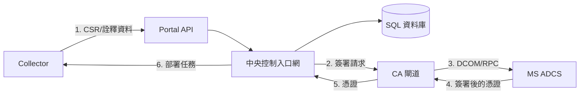

# 系統架構 (System Architecture)

## 概述 (Overview)
Enterprise Internal PKI Manager 被設計為一個分散式系統，旨在使用集中式的 Microsoft ADCS 後端，管理跨多種平台（如 IIS、F5、雲端）的憑證生命週期。

## 核心組件 (Core Components)

### 1. 中央控制入口網 (Center Control Portal)
- **角色**：中央管理與編排中心。
- **功能**：
    - 核心業務邏輯。
    - SQL 資料庫：儲存狀態、稽核日誌與憑證詮釋資料 (Metadata)。
    - Active Directory (AD) 驗證：用於管理員存取控制。
    - RESTful API：用於與 Collector (收集代理程式) 及 Gateway (閘道) 通訊。
    - **Web Portal 管理介面 (Web Portal UI)**：
        - **憑證盤點儀表板 (Certificate Inventory Dashboard)**：
            - **集中化列表**：彙整所有已發現與已管理的憑證視圖。
            - **關鍵欄位**：
                - **核發 CN (Common Name)**：憑證的通用名稱。
                - **到期日**：標示顏色（紅色表示已過期或即將到期）。
                - **存放位置**：發現此憑證的端點數量（例如：「共 4 處」）。點擊可顯示 IP/主機名列表。
                - **金鑰強度**：根據演算法與長度政策進行自動評核（例如：安全 ✅ 或 不安全 ⚠️）。
                - **狀態**：使用中、已撤銷、已過期。
            - **操作**：按狀態篩選、按 CN 搜尋、**匯出** 為 CSV/PDF。
        - **憑證詳情面板 (側邊欄)**：
            - **一般資訊**：序號、指紋 (Thumbprint)、核發者 DN、到期日。
            - **技術規格**：
                - **金鑰規格**：演算法與長度（如 RSA-2048, Dilithium3）。
                - **主機別名 (SANs)**：主體別名的完整列表。
            - **應用關聯 (稽核軌跡)**：
                - 關聯至原始 **申請單 (Request Ticket)**。
                - 申請人姓名、核准時間戳記、業務用途。
            - **部署位置**：
                - 發現此特定憑證雜湊值的端點（IP/主機名）詳細列表。
                - 設備類型（如 F5 Profile、IIS 站點綁定）。
    - **合規報表引擎 (Compliance Reporting Engine)**：
        - **弱點報表**：識別弱演算法（SHA-1, RSA < 2048）及不符合規定的金鑰長度。
        - **覆蓋率報表**：對比「已發現」與「已管理」的憑證，凸顯影子 IT (Shadow IT) 問題。
        - **到期稽核**：列出已過期憑證並預測未來的更新需求（30/60/90 天）。

    - **警示與通知系統 (Alerting & Notification System)**（關鍵）：
        - **多通路傳送**：支援電子郵件、MS Teams/Slack Webhooks，以及針對 P1 警示的簡訊 (SMS)。
        - **呈報政策 (Escalation Policy)**（防止類似 SpaceX 的斷線事故）：
            - **到期前 30 天**：通知憑證擁有者。
            - **到期前 7 天**：通知擁有者及其直屬主管。
            - **到期前 24 小時**：對資安監控中心 (SOC) 與 SRE 團隊發出 **緊急警報 (Panic Alert)**。
        - **部署失敗偵測**：
            - 若憑證在資料庫中已標記為「已更新」，但 **Collector** 在實際連接埠上仍偵測到舊的序號，系統將發出警示（表示安裝失敗）。

### 2. CA 閘道 (CA Gateway)
- **角色**：與 Microsoft ADCS 介接的中間服務。
- **功能**：
    - 抽象化 ADCS DCOM/RPC 的複雜操作。
    - 處理從 Portal 發送的憑證簽署請求 (CSR)。
    - 將核發的憑證回傳給 Portal。

### 3. 收集代理程式 (Collector)
- **角色**：部署於基礎設施各處的遠端代理程式。
- **功能**：
    - **發現 (Discovery)**：掃描端點（IIS、F5 負載平衡器、雲端執行個體）以尋找現有的憑證。
    - **部署 (Deployment)**：自動化安裝新憑證或更新後的憑證。
    - **監控 (Monitoring)**：回報憑證健康狀況與到期情形。

## 後量子加密準備 (PQC Readiness / Post-Quantum Cryptography)

為了確保長期的安全性，系統核心採用了 **加密敏捷性 (Crypto-Agility)** 設計：

1.  **混合憑證支援 (Hybrid Certificate Support)**：
    - 資料結構支援為單一識別身分儲存多組金鑰對（例如：傳統 RSA-2048 + PQC Dilithium）。
    - **Collector** 中的 CSR 產生邏輯採用模組化設計，允許更換加密函式庫（例如：整合 **Open Quantum Safe** 的 liboqs）。

2.  **演算法敏捷性 (Algorithm Agility)**：
    - 資料庫中用於金鑰與簽章的欄位使用 `VARBINARY(MAX)` 或 `BLOB`，以容納較大的 PQC 金鑰尺寸（PQC 金鑰通常比 RSA/ECC 大得多）。
    - API 合約 (gRPC/Protobuf) 使用通用的 `bytes` 欄位處理金鑰，而非演算法特定的結構。

3.  **過渡策略 (Transition Strategy)**：
    - **發現階段**：Collector 會識別舊型演算法（SHA-1, RSA-1024）以進行立即補救。
    - **並行核發**：具備在核發傳統憑證的同時，並行核發 PQC 憑證的能力，以便在不影響生產環境的情況下進行相容性測試。

## 數據與流程 (Data & Process Flow)

典型的生命週期流程如下：

1. **發現/請求**：**Collector** 識別需求或接收觸發指令，並將詮釋資料或 CSR 發送至 **Portal API**。
2. **處理**：**中央控制入口網** 根據政策驗證請求，並將意圖儲存於 **SQL 資料庫** 中。
3. **核發**：**Portal** 將請求轉發至 **CA Gateway**。
4. **CA 互動**：**CA Gateway** 透過 DCOM/RPC 與 **MS ADCS** 通訊以簽署憑證。
5. **履行**：簽署後的憑證回傳路徑為：**ADCS** -> **Gateway** -> **Portal**。
6. **部署**：**Portal** 通知或指派任務給 **Collector**，隨後由其將憑證部署至目標設備（IIS、F5 等）。

