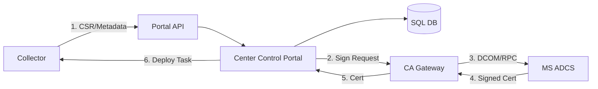

# System Architecture

## Overview
The Enterprise Internal PKI Manager is designed as a distributed system to manage certificate lifecycles across various platforms (IIS, F5, Cloud) using a centralized Microsoft ADCS backend.

## Core Components

### 1. Center Control Portal
- **Role**: Central management and orchestration hub.
- **Features**:
    - Core business logic.
    - SQL Database for state, audit logs, and certificate metadata.
    - Active Directory (AD) Authentication for administrative access.
    - RESTful API for Collector and Gateway communication.

### 2. CA Gateway
- **Role**: Intermediate service that interfaces with Microsoft ADCS.
- **Features**:
    - Abstracts ADCS DCOM/RPC complexities.
    - Handles certificate signing requests (CSRs) sent from the Portal.
    - Returns issued certificates to the Portal.

### 3. Collector
- **Role**: Remote agent deployed across the infrastructure.
- **Capabilities**:
    - **Discovery**: Scans endpoints (IIS, F5 Load Balancers, Cloud instances) for existing certificates.
    - **Deployment**: Automates the installation of new/renewed certificates.
    - **Monitoring**: Reports on certificate health and expiry.

## Data & Process Flow

The typical lifecycle flow follows this path:

1. **Discovery/Request**: The **Collector** identifies a need or receives a trigger. It sends metadata or a CSR to the **Portal API**.
2. **Processing**: The **Center Control Portal** validates the request against policy and stores the intent in the **SQL DB**.
3. **Issuance**: The **Portal** forwards the request to the **CA Gateway**.
4. **CA Interaction**: The **CA Gateway** communicates with **MS ADCS** to sign the certificate.
5. **Fulfilment**: The signed certificate travels back: **ADCS** -> **Gateway** -> **Portal**.
6. **Deployment**: The **Portal** notifies/tasks the **Collector**, which then deploys the certificate to the target (IIS, F5, etc.).

