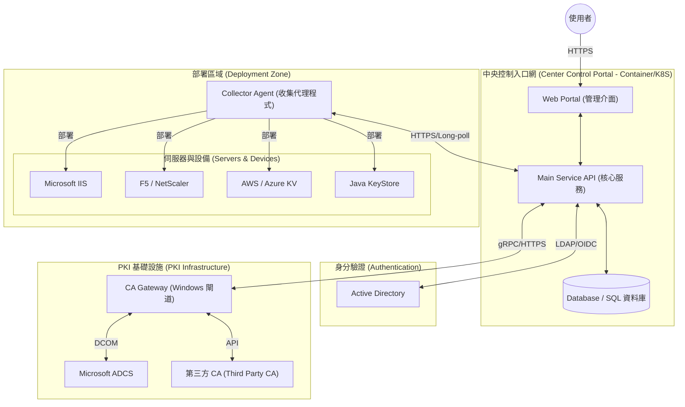

# Enterprise Internal PKI Manager (企業內部 PKI 管理系統)

**自動化 Windows CA 的內部憑證生命週期管理。**

> 🚀 **後量子加密準備 (PQC Ready)**：專為後量子加密 (Post-Quantum Cryptography) 敏捷性與混合憑證支援而設計。

## 系統架構 (System Architecture)

基於企業生命週期自動化模型：

## 專案目標 (Goal)
本專案的目標是提供一個穩定且自動化的解決方案，利用 Microsoft Active Directory Certificate Services (ADCS) 來管理企業環境內內部憑證的完整生命週期。

## 核心功能 (Key Features)
- **標準化 (Standardization)**：為所有 PKI 操作提供 REST/gRPC 介面。
- **自動化 (Automation)**：為 IIS、Linux 和網路設備提供零接觸 (Zero-touch) 憑證更新。
- **後量子加密準備 (PQC Ready)**：架構支援演算法敏捷性，以因應未來的量子安全過渡。

## 系統組件 (Components)
- **中央控制入口網 (Center Control Portal)**：系統的大腦，負責管理邏輯與狀態。
- **CA 閘道 (CA Gateway)**：連接 Microsoft PKI 基礎設施的橋樑。
- **收集代理程式 (Collector)**：佈署於各處的眼與手，負責發現 (Discovery) 與部署 (Deploy) 憑證。

## 入門指南 (Getting Started)
請參閱 [ARCHITECTURE.md](ARCHITECTURE.md) 以深入瞭解運作原理。
