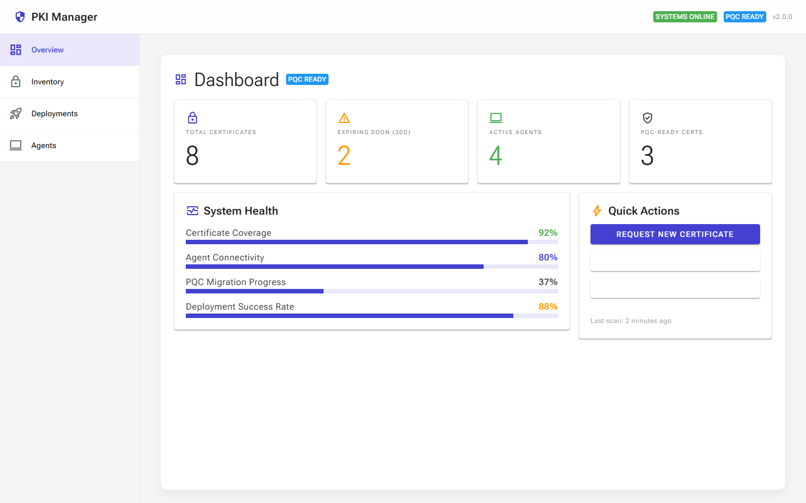
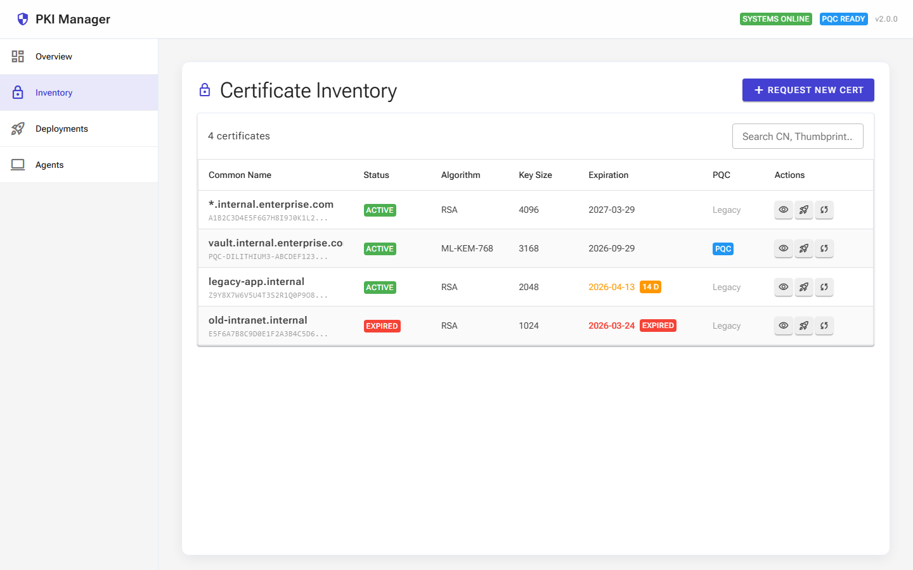
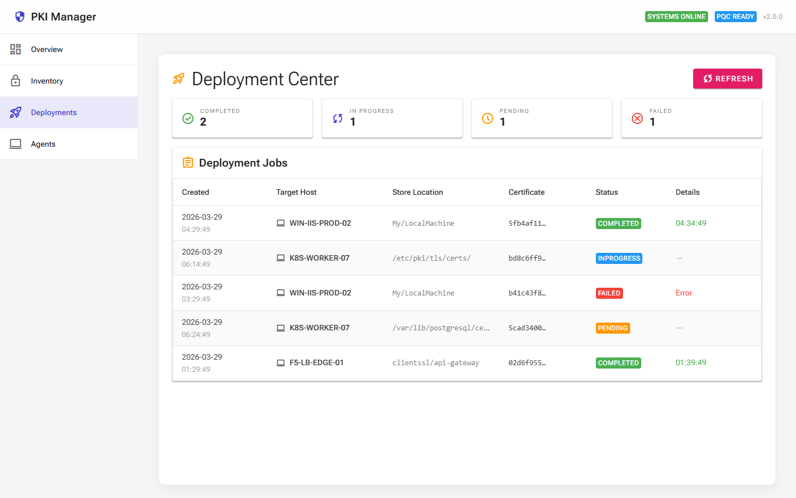
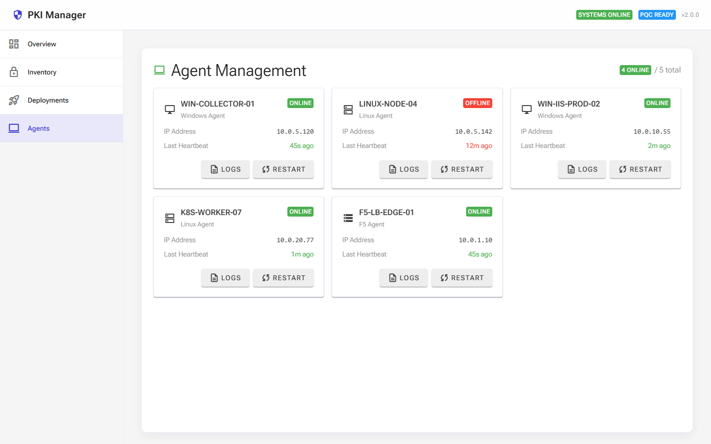

# Enterprise Internal PKI Manager — 使用手冊

> **版本**: v2.0.0  
> **UI 框架**: Radzen Blazor 8.0.0（Material 主題）  
> **平台**: .NET 10 Blazor Server + WebAssembly（InteractiveAuto）  
> **最後更新**: 2026-03-29

---

## 目錄

1. [系統概觀](#1-系統概觀)
2. [儀表板（Dashboard）](#2-儀表板dashboard)
3. [憑證清單（Certificate Inventory）](#3-憑證清單certificate-inventory)
4. [部署中心（Deployment Center）](#4-部署中心deployment-center)
5. [代理程式管理（Agent Management）](#5-代理程式管理agent-management)
6. [系統架構](#6-系統架構)
7. [快速入門](#7-快速入門)
8. [常見問題](#8-常見問題)

---

## 1. 系統概觀

Enterprise Internal PKI Manager 是一套企業內部憑證生命週期管理平台，提供：

- **憑證發行與管理**：透過 ADCS（Active Directory Certificate Services）整合，統一管理內部 X.509 憑證
- **自動化部署**：將憑證自動部署至 Windows 伺服器、Linux 節點、F5 負載平衡器等目標
- **PQC 準備度追蹤**：監控後量子密碼學（Post-Quantum Cryptography）遷移進度
- **Agent 監控**：即時追蹤散佈於企業網路中的收集器代理程式狀態

### 導覽列

系統左側導覽列提供四個主要功能區域：

| 圖示 | 選項 | 說明 |
|------|------|------|
| 📊 | **Overview** | 系統儀表板總覽 |
| 🔒 | **Inventory** | 憑證清單與搜尋 |
| 🚀 | **Deployments** | 部署作業管理 |
| 💻 | **Agents** | 代理程式監控 |

### 頂部狀態列

頁面右上角顯示即時系統狀態：
- **SYSTEMS ONLINE**（綠色）：所有後端服務正常運行
- **PQC READY**（藍色）：系統支援後量子密碼學演算法

---

## 2. 儀表板（Dashboard）



儀表板是登入後的首頁，提供系統全貌的即時摘要。

### 2.1 統計卡片

頂部四張統計卡片顯示關鍵指標：

| 卡片 | 說明 | 注意事項 |
|------|------|----------|
| **Total Certificates** | 系統管理的憑證總數 | — |
| **Expiring Soon (30d)** | 30天內即將到期的憑證數（橘色警示） | 數字 > 0 表示需要立即處理 |
| **Active Agents** | 目前在線的代理程式數量（綠色） | — |
| **PQC-Ready Certs** | 已遷移至後量子密碼學演算法的憑證數 | — |

### 2.2 系統健康度

左側面板以進度條顯示四項健康指標：

- **Certificate Coverage**：憑證覆蓋率（受管理端點中已安裝有效憑證的比例）
- **Agent Connectivity**：代理程式連線率（在線 Agent 佔總數比例）
- **PQC Migration Progress**：PQC 遷移進度（PQC 憑證佔總憑證比例）
- **Deployment Success Rate**：部署成功率

### 2.3 快速操作

右側面板提供三個常用功能的快速入口：

- **Request New Certificate**：跳轉至憑證清單頁面，開始申請新憑證
- **Manage Deployments**：跳轉至部署中心
- **View Agents**：跳轉至代理程式管理

---

## 3. 憑證清單（Certificate Inventory）



此頁面列出所有受管理的 X.509 憑證，支援搜尋、排序與狀態篩選。

### 3.1 功能區域

- **Request New Cert 按鈕**（右上角紫色按鈕）：發起新的憑證簽發請求
- **搜尋框**：輸入 Common Name 或 Thumbprint 進行即時篩選
- **憑證計數**：左上角顯示當前顯示的憑證數量

### 3.2 資料欄位

| 欄位 | 說明 |
|------|------|
| **Common Name** | 憑證主體名稱（CN），下方灰色小字為 Thumbprint 摘要 |
| **Status** | 憑證狀態徽章：<br>🟢 **ACTIVE**（綠色）= 有效<br>🔴 **EXPIRED**（紅色）= 已過期 |
| **Algorithm** | 加密演算法（RSA、ML-KEM-768 等） |
| **Key Size** | 金鑰長度（bits） |
| **Expiration** | 到期日期，附帶警示：<br>🟡 **N d**（黃色）= N 天後到期<br>🔴 **EXPIRED**（紅色）= 已過期 |
| **PQC** | 後量子標記：<br>🔵 **PQC**（藍色）= PQC 演算法<br>灰色 **Legacy** = 傳統演算法 |
| **Actions** | 操作按鈕：👁 檢視 / 🚀 部署 / 🔄 續期 |

### 3.3 搜尋功能

在搜尋框中輸入文字會即時過濾憑證列表：
- 支援 Common Name 模糊匹配
- 支援 Thumbprint 模糊匹配
- 不區分大小寫

---

## 4. 部署中心（Deployment Center）



管理憑證部署作業的核心頁面，追蹤每個部署任務的執行狀態。

### 4.1 狀態摘要卡片

頂部四張卡片即時統計各狀態的部署任務數：

| 卡片 | 顏色 | 說明 |
|------|------|------|
| **Completed** | ✅ 綠色 | 已成功完成的部署 |
| **In Progress** | 🔵 藍色 | 正在執行中的部署 |
| **Pending** | ⏳ 橘色 | 等待執行的部署 |
| **Failed** | ❌ 紅色 | 執行失敗的部署 |

### 4.2 部署作業表格

| 欄位 | 說明 |
|------|------|
| **Created** | 任務建立時間（日期 + 時間） |
| **Target Host** | 目標主機名稱（含電腦圖示） |
| **Store Location** | 憑證存放位置（如 `My/LocalMachine`、`/etc/pki/tls/certs/`） |
| **Certificate** | 關聯的憑證 ID（前8碼） |
| **Status** | 狀態徽章：COMPLETED / INPROGRESS / PENDING / FAILED |
| **Details** | 完成時間（綠色）或錯誤訊息（紅色） |

### 4.3 操作功能

- **Refresh 按鈕**（右上角）：手動重新載入部署任務清單
- 點擊表格標題列可依該欄位排序

### 4.4 部署目標類型

系統支援多種部署目標：

| 目標類型 | 範例 | Store Location 格式 |
|----------|------|---------------------|
| Windows IIS | `WIN-IIS-PROD-02` | `My/LocalMachine` |
| Linux 伺服器 | `K8S-WORKER-07` | `/etc/pki/tls/certs/` |
| F5 負載平衡器 | `F5-LB-EDGE-01` | `clientssl/api-gateway` |
| PostgreSQL | `K8S-WORKER-07` | `/var/lib/postgresql/certs/` |

---

## 5. 代理程式管理（Agent Management）



監控與管理散佈於企業網路中的收集器代理程式。

### 5.1 摘要資訊

頁面右上角顯示即時統計：
- **N online**（綠色徽章）：在線代理程式數
- **/ M total**：代理程式總數

### 5.2 代理程式卡片

每個代理程式以獨立卡片呈現，包含：

| 資訊 | 說明 |
|------|------|
| **主機名稱** | 代理程式所在主機（粗體） |
| **Agent 類型** | Windows Agent / Linux Agent / F5 Agent |
| **狀態徽章** | 🟢 **ONLINE**（綠色）= 在線<br>🔴 **OFFLINE**（紅色）= 離線 |
| **IP Address** | 代理程式的網路位址 |
| **Last Heartbeat** | 最後心跳時間（相對時間格式）：<br>綠色 = 5分鐘內<br>紅色 = 超過5分鐘 |

### 5.3 判斷邏輯

- **ONLINE**：最後心跳在 5 分鐘以內
- **OFFLINE**：最後心跳超過 5 分鐘

### 5.4 操作按鈕

每張卡片底部提供：
- **Logs**：檢視該代理程式的執行日誌
- **Restart**：遠端重啟代理程式

---

## 6. 系統架構

```
┌─────────────┐     ┌─────────────┐     ┌──────────────────┐
│  Portal.UI  │────▶│   Portal    │────▶│     Gateway       │
│  (Blazor)   │     │  (REST API) │     │ (ADCS Integration)│
└─────────────┘     └─────────────┘     └──────────────────┘
                           │                       │
                           ▼                       ▼
                    ┌─────────────┐         ┌────────────┐
                    │  Collector  │         │  ADCS / CA  │
                    │  (Agent)    │         │  (Windows)  │
                    └─────────────┘         └────────────┘
```

| 元件 | 說明 |
|------|------|
| **Portal.UI** | Blazor 前端介面（本手冊所述的使用者介面） |
| **Portal** | 業務邏輯 API，處理憑證、部署、代理程式管理 |
| **Gateway** | CA 整合閘道，負責與 ADCS 通訊，含速率限制和認證 |
| **Collector** | 代理程式，部署在各伺服器上，負責憑證掃描與部署執行 |
| **WindowsAgent** | Windows 專用代理，透過 DCOM 與 ADCS 互動 |

---

## 7. 快速入門

### 7.1 啟動系統

```bash
# 1. 啟動 Portal API
cd src/Portal
dotnet run

# 2. 啟動 Gateway
cd src/Gateway
dotnet run

# 3. 啟動 Portal UI
cd src/Portal.UI/Portal.UI
dotnet run
```

預設 URL：
- **Portal UI**：`http://localhost:5261`
- **Portal API**：`http://localhost:5069`
- **Gateway**：`http://localhost:5001`

### 7.2 使用 Docker Compose

```bash
docker-compose up -d
```

### 7.3 基本操作流程

1. 開啟瀏覽器連線至 `http://localhost:5261`
2. 儀表板顯示系統概況
3. 點擊左側導覽列的 **Inventory** 查看憑證
4. 點擊 **Request New Cert** 開始申請新憑證
5. 在 **Deployments** 頁面追蹤部署進度
6. 在 **Agents** 頁面確認代理程式狀態

---

## 8. 常見問題

### Q: 儀表板數字顯示為 0？
**A**: 系統啟動後需要 Portal API 提供數據。請確認 Portal API 服務正在運行，並檢查 `appsettings.json` 中的 `PortalApi:BaseUrl` 設定。若 API 無法連線，系統會顯示預設的示範數據。

### Q: 代理程式顯示 OFFLINE？
**A**: 當代理程式超過 5 分鐘未發送心跳，即判定為離線。請檢查：
- 代理程式服務是否正在運行
- 網路連線是否正常
- Portal API 的防火牆規則是否允許代理程式連入

### Q: 搜尋功能沒有反應？
**A**: 搜尋為前端即時過濾，確認已正確載入頁面資料。若頁面顯示載入指示器（旋轉圓圈），表示 API 連線可能有問題。

### Q: 部署任務狀態卡在 INPROGRESS？
**A**: 部署由目標主機上的 Collector Agent 執行。請確認：
- 目標主機的 Agent 顯示為 ONLINE
- Agent 有權限存取指定的 Store Location
- 網路連線正常

### Q: 如何新增 PQC 演算法支援？
**A**: 系統已支援 ML-KEM-768（CRYSTALS-Kyber）等後量子演算法。在申請憑證時選擇 PQC 演算法模板即可。儀表板的 PQC Migration Progress 指標會自動追蹤遷移進度。

### Q: 系統支援哪些瀏覽器？
**A**: 支援所有現代瀏覽器：
- Chrome 90+
- Firefox 90+
- Edge 90+
- Safari 15+

---

> **技術支援**：如遇到系統問題，請聯絡 IT 安全團隊或提交 GitHub Issue。
